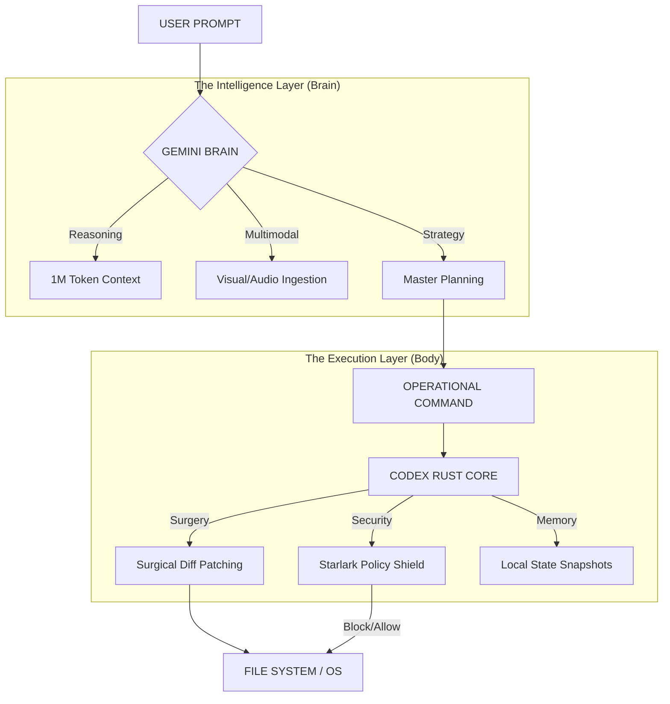

# Visual Concepts: The Cybernetic Super-Agent
**The Fusion of Gemini CLI (Intelligence) & Codex CLI (Precision)**

---

## 🧠 Concept 1: The Anatomy of Orchestration
This diagram illustrates how your "Brain" (Gemini) makes strategic decisions while the "Body" (Codex) performs the technical surgery.



---

## 🖥️ Concept 2: The "Cyber-Architect" Terminal
A conceptual mockup of how the combined CLI interface would look, merging Gemini's conversational depth with Codex's precision tools.

```text
+-----------------------------------------------------------------------+
|  MWA NEURAL TERMINAL [v4.0-SUPER-AGENT]              [ PORT: 3000 ]   |
+-----------------------------------------------------------------------+
| > USER: "Refactor the ProjectList to use the new HSL variables."      |
|                                                                       |
| [🧠 GEMINI BRAIN]: Analyzing 12 files in current context...           |
| Strategy: Update Tailwind config -> Map CSS vars -> Patch components. |
|                                                                       |
| [🛡️ CODEX POLICY]: CMD: 'npm install' ALLOWED in F:\MWA               |
|                                                                       |
| [🔪 SURGICAL PATCH]: src/components/ProjectList.tsx                   |
| - <span className="text-cyan-400">                                    |
| + <span className="text-accent">                                      |
|                                                                       |
| [💾 SNAPSHOT]: Session saved at 2026-02-03_22:15:04                   |
|                                                                       |
| > _                                                                   |
+-----------------------------------------------------------------------+
| /explain | /test | /rollback | /mwa-generate | [STATUS: SYNCHRONIZED] |
+-----------------------------------------------------------------------+
```

---

## 🛡️ Concept 3: The Security Shield (Codex Logic)
Visualizing how the Codex Rust Core acts as a firewall between the LLM and your OS.

```text
      [ 🌐 INTERNET / LLM ]
               |
               v
      +-----------------+
      |  GEMINI PRO 3   |  <-- Can suggest anything (Safe or Risky)
      +-----------------+
               |
      [ 🔐 CODEX SHIELD ]  <-- Rust + Starlark Policy Engine
      |                 |
      | [RULE: No /etc] |  <-- "Denied: Access to root directories"
      | [RULE: npm OK ] |  <-- "Allowed: Node operations in F:\MWA"
      |                 |
      +--------+--------+
               |
               v
      [ 📁 LOCAL FILES ]   <-- Only approved changes occur here
```

---

## ⏳ Concept 4: The Time-Travel Loop
Using Codex's session snapshots to ensure development is reversible.

1. **State A:** Working Prototype.
2. **Brain Suggests:** "Let's change the 3D Engine to use Raymarching."
3. **Body Action:** *Snapshot created.* -> *Patch applied.*
4. **Result:** Build fails.
5. **Body Action:** `/rollback` -> Instant return to **State A**.

**Keywords for further visualization:** `Cybernetic Feedback Loop`, `Surgical Diffing`, `Policy-Gated Autonomy`.
